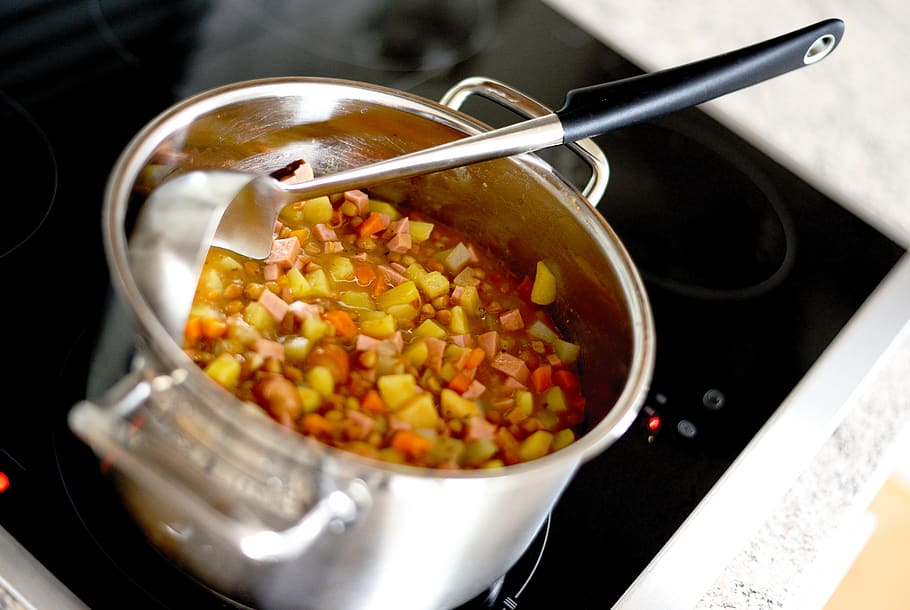

<style>
.forceBreak { -webkit-column-break-after: always; break-after: column; }
</style>

```{r setup, include=FALSE}
knitr::opts_chunk$set(echo = FALSE)
```

## Definition of Statistics

- A "statistic" is a number that summarizes data.
- An average is an example of a statistic.
- In Statistics, we think deeply about:
  - collection of data
  - summarization of data (with statistics)
  - conclusions we can draw from data.
- Statistics is the language, tools, and logic of research.
- Statistics is quantitative epistemology - the study of knowledge itself.
- How should someone update their beliefs when provided new information?
- How should someone use data to make predictions?


## Inference, soup {.small}

- In Statistics, our final goal is inference.
- From a small **sample**, we infer about a larger **population**.
- A chef tastes soup with a spoon:
  - The spoonful is a sample.
  - The statistic = "delicious".
  - The chef infers the whole soup tastes delicious.
  - Hopefully the sample (spoon) was **representative** of the population (pot).


<div class="centered">
{width=250px,height=auto}
</div>
</div>

## Archery example {.columns-2}

.jpg){width=100%; height=auto}

<div class="footnote">
Creative Commons Attribution-Share Alike 2.0 Generic license. 	
Attribution: Korea.net / Korean Culture and Information Service
</div>

- sample = 12 shots
- population = infinite potential shots under these conditions
- inference = should this archer adjust her aim?


<p class="forceBreak"></p>


```{r 1samplearchery,fig.width=3,fig.height=3,fig.align="center"}
set.seed(1)
while(T){
  sigma = round(2^runif(1,5,7),1)
  n = 12 #sample(c(12*1:3,10*2:8),1)
  alpha = 0.05
  SE = sigma/sqrt(n)
  ME = qnorm(1-alpha/2)*SE
  mux = sample(c(-ME,-ME/2,ME/2,ME),1)
  x = round(rnorm(n,mux,sigma))
  y = round(rnorm(n,0,sigma))
  t = abs(mean(x))/(sd(x)/sqrt(n))
  cumulative = pt(t,n-1)
  pval = 2*(1-cumulative)
  t2 = abs(mean(y))/(sd(y)/sqrt(n))
  cumulative2 = pt(t2,n-1)
  pval2 = 2*(1-cumulative2)
  # if(pval<0.2 & pval>0.001 & abs(pval-0.05)>0.01){break}
  if(pval<0.06 & pval>0.04 & pval2>0.2){break}
}
makebullseye = function(scale=1,axes=T){
  x = cos(2*seq(0,pi,length.out=1000)*pi)*scale
  y = sin(2*seq(0,pi,length.out=1000)*pi)*scale
  plot(x,y,type="l",lwd=3,xlim=c(-scale,scale)*1.1,ylim=c(-scale,scale)*1.1,ann=F,axes=axes)
  lines(x=c(-1,1,1,-1,-1)*scale*1.1,y=c(1,1,-1,-1,1)*scale*1.1,lwd=4)
  colors = c("yellow","yellow","red","red","blue","blue","grey30","grey30","white","white")
  linecolors = c(rep("black",6),"white",rep("black",3))
  textcolors = c(rep("black",6),rep("white",2),rep("black",2))
  for(i in 10:1){
    x2 = x*i/10
    y2 = y*i/10
    polygon(x2[1:(length(x2)-1)],y2[1:(length(x2)-1)],col=colors[i],border=F)
    lines(x2,y2,col=linecolors[i])
  }
  points(0,0,pch=20,cex=0.5)
}
par(mar=c(0,0,0,0))
makebullseye(300,T)
# mtext("horizontal position, x (mm)",1,line=2)
# mtext("vertical position, y (mm)",2,line=2)
# abline(v=seq(-300,300,25),lwd=1,lty=2)
# abline(h=seq(-300,300,25),lwd=1,lty=2)
points(x,y,pch=20,cex=1.5)
for(i in 1:n){
  rot = runif(1,0,2*pi)
  rot2 = rot+2*pi/3
  rot3 = rot2+2*pi/3
  lines(c(x[i],x[i]+20*cos(rot)),c(y[i],y[i]+20*sin(rot)),lwd=3)
  lines(c(x[i],x[i]+20*cos(rot2)),c(y[i],y[i]+20*sin(rot2)),lwd=3)
  lines(c(x[i],x[i]+20*cos(rot3)),c(y[i],y[i]+20*sin(rot3)),lwd=3)
}
points(x,y,pch=20,cex=0.5,col=rgb(0.2,1,0.2))
```
\

<div class="centered">
- statistics: $$\bar{x}=`r mean(x)`\text{ mm}$$  $$s_x=`r round(sd(x),1)`\text{ mm}$$
</div>


## Basketball freethrows example {.smaller}

- In 2020-21 regular season, Chris Paul attempted 181 freethrows and made 169 of them (93.4%).

- Damian Lillard attempted 483 and made 448 of them (92.8%).

- Can we conclusively say Chris Paul is a better freethrow shooter?


```{r}
prop.test(c(169,448),c(181,483))
```
2 samples: the attempts. 2 populations: the infinite potential attempts.  The inference: it is very plausible that chance accounts for the difference.

## Correlation is not causation {.columns-2 }

```{r cars,fig.width=4,fig.height=4}
plot(mtcars$wt*1000,mtcars$hp,ylab="Horsepower",xlab="Weight (lbs)",main="Car horsepower is linked to weight",pch=20)
wt = mtcars$wt*1000
abline(lm(mtcars$hp~wt),col=rgb(1,0.4,0.4,0.8))
```

- Sample = 32 cars from 1974 Motor Trend magazine
- Population = all cars (from 1974)
- Inference = weight and hp are positively correlated
- Cars that weigh more tend to use higher horsepower.
- However, you won't increase the horsepower by filling a car with bricks.


## Types of data

- **Binary**
  * 2 options: yes/no, success/fail, 0/1, orange/not orange
- **Discrete**
  * limited numerical options: dice rolls, # stairs between floors
  * [count noun](https://en.wikipedia.org/wiki/Count_noun){target="_blank"}, "how many"
- **Continuous**
  * infinite numerical options: exact timing, exact distance
  * [mass noun](https://en.wikipedia.org/wiki/Mass_noun){target="_blank"}, "how much"
- **Categorical** (not examined much in introductory stats)
  * 2 or more nonnumeric options: favorite color


## Binary spinner {.columns-2 .smaller}

```{r, fig.width=3,fig.height=3}
par(mar=c(0,0,0,0))
theta = seq(0,2*pi,length.out=1000)
plot(cos(theta),sin(theta),xlim=c(-1,1),ylim=c(-1,1),axes=F,ann=F,type="l",lwd=3)
lines(c(0,sqrt(2)/2),c(0,sqrt(2)/2),lwd=2)
lines(c(0,-sqrt(2)/2),c(0,sqrt(2)/2),lwd=2)
lines(c(0,sqrt(2)/2),c(0,-sqrt(2)/2),lwd=2)
lines(c(0,-sqrt(2)/2),c(0,-sqrt(2)/2),lwd=2)
text(0,0.75,"yes")
text(0.75,0,"yes")
text(-0.75,0,"no")
text(0,-0.75,"yes")
polygon(cos(theta)*0.1,sin(theta)*0.1,col="red")
arrows(-0.8,-0.3,0.8,0.3,lwd=8)
arrows(-0.8,-0.3,0.8,0.3,lwd=6,col="red")
polygon(cos(theta)*0.02,sin(theta)*0.02,col="red")
```


Population = the infinite potential spins
Population parameters:
$$\text{population proportion} = p = 0.75$$


```{r}
set.seed(123)
x = sample(c(0,1),10,T,c(0.25,0.75))
```


<br class="forceBreak"></br>

As an example, imagine spinning 10 times.

Sample: `r x`

Sample statistics:
$$\text{sample size} = n = `r length(x)`$$
$$\text{sample success count} = `r sum(x)`$$
$$\text{sample proportion} = \hat{p} = `r mean(x)` $$

<p>
<p>


## Discrete spinner {.columns-2 .smaller}

```{r dicespinner, fig.width=3,fig.height=3}
par(mar=c(0,0,0,0))
theta = seq(0,2*pi,length.out=1000)
plot(cos(theta),sin(theta),xlim=c(-1,1),ylim=c(-1,1),axes=F,ann=F,type="l",lwd=3)
theta2 = seq(0,2*pi,2*pi/6)
for(the in theta2){
  lines(c(0,sin(the)),c(0,cos(the)))
}
mids = (theta2[2:7]+theta2[1:6])/2
for(i in 1:length(mids)){
  r=0.7
  text(sin(mids[i])*r,cos(mids[i])*r,i)
}

polygon(cos(theta)*0.1,sin(theta)*0.1,col="red")
arrows(-0.8,-0.3,0.8,0.3,lwd=8)
arrows(-0.8,-0.3,0.8,0.3,lwd=6,col="red")
polygon(cos(theta)*0.02,sin(theta)*0.02,col="red")
```

- population mean (unit 2)
$$\mu = 3.5$$
- population standard deviation (unit 2)
$$\sigma = `r sqrt((36-1)/12)`$$

<!-- `r sqrt(sum((1:6-3.5)^2)/6)` -->
<!-- <br class="forceBreak"></br> -->

```{r dicerolls}
set.seed(123)
x = sample(1:6,10,T)
```
* sample
$$`r x`$$
* sample size
$$n=`r length(x)`$$
* sample total (sample sum)
$$\sum{x} = `r sum(x)`$$
* sample mean
$$\bar{x} = `r mean(x)`$$
* sample standard deviation
$$s = `r round(sd(x),2)`$$

## Continuous spinner {.columns-2 .smaller}

```{r sns, fig.width=3.5,fig.height=3.5}
par(mar=c(0,0,0,0))
theta = seq(0,2*pi,length.out=1000)
plot(cos(theta),sin(theta),xlim=c(-1,1),ylim=c(-1,1),axes=F,ann=F,type="l",lwd=3)
zz = seq(-3.5,3.5,0.1)
for(z in zz){
  if(z%%1==0){
    lwd=3
    len=0.2
  } else if(z%%0.5==0){
    lwd=2
    len=0.1
  } else {
    lwd=1
    len=0.05
  }
  th = pnorm(z)*2*pi
  lines(c(1-len,1)*sin(th),c(1-len,1)*cos(th),lwd=lwd)
  if(z<=2 & z>=-2){
    text((1-len)*sin(th)*0.9,(1-len)*cos(th)*0.9,round(z,2),cex=lwd*0.4)
  }
}

polygon(cos(theta)*0.1,sin(theta)*0.1,col="red")
arrows(-0.7,-0.2,0.7,0.2,lwd=8)
arrows(-0.7,-0.2,0.7,0.2,lwd=6,col="red")
polygon(cos(theta)*0.02,sin(theta)*0.02,col="red")
text(0,0.4,"standard\nnormal\nspinner")
```

- population mean (unit 3)
$$\mu = 0$$
- population standard deviation (unit 3)
$$\sigma = 1$$

<!-- `r sqrt(sum((1:6-3.5)^2)/6)` -->
<!-- <br class="forceBreak"></br> -->

```{r normspins}
set.seed(1234)
x = rnorm(10)
```
* sample: `r x`
* sample size
$$n=`r length(x)`$$
* sample total (sample sum)
$$\sum{x} = `r sum(x)`$$
* sample mean
$$\bar{x} = `r mean(x)`$$
* sample standard deviation
$$s = `r round(sd(x),4)`$$

## Histogram and frequency table {.smaller .flexbox}

```{r histy,fig.width=6,fig.height=5}
set.seed(123)
x = rnorm(1000)
hist(x,main="Histogram of 1000 spins of standard normal spinner",xlab="spin value")
rug(x,col=rgb(1,0.1,0.3,0.5))
```

<style type="text/css" rel="stylesheet">
.bordered-table {
    border-collapse: collapse;
    border-spacing: 0;
    border:2px solid #000000;
    color:black;
    background-color: white;
}
.bordered-table th {
    border:2px solid #000000;
    padding: 4px;
}
.bordered-table td{
    border:1px solid #000000;
    padding: 4px;
}
</style>

```{r freqdist}
set.seed(123)
x = rnorm(1000)
myhist = hist(x,plot=F)
breaks = myhist$breaks
frequency = myhist$counts
n = length(frequency)
interval = paste0(breaks[1:n]," to ",breaks[2:(n+1)],sep="")
knitr::kable(data.frame(interval,frequency),format="html",table.attr='class="bordered-table"', align = "cc",row.names=F)
```

## Dice hist and freq tab {.smaller .flexbox}

```{r dicehisty,fig.width=6,fig.height=5}
set.seed(123)
x = sample(1:6,1000,T)
b = seq(0.5,6.5,1)
myhist = hist(x,main="Histogram of 1000 rolls of 6-sided dice",xlab="roll value",breaks=b)
```

```{r diceft}
set.seed(123)
x = rnorm(1000)
breaks = myhist$breaks
frequency = myhist$counts
n = length(frequency)
interval = paste0(breaks[1:n]," to ",breaks[2:(n+1)],sep="")
knitr::kable(data.frame(interval,frequency),format="html",table.attr='class="bordered-table"', align = "cc",row.names=F)
```


## Notation reference{.smaller}

$n$ = sample size, how many measurements

$\#(\ldots)$ = how many measurements satisfy $\ldots$ criterion. (nonstandard notation)

- Binary
  * $p$ = population proportion
  * $\hat{p}$ = "p hat" = sample proportion
- Discrete
  * $\mu$ = "mu" = population mean
  * $\sigma$ = "sigma" = population standard deviation
  * $\sum x$ = "sum of x" = sample total
  * $\bar{x}$ = "x bar" = sample mean
  * $s$ = sample standard deviation (with Bessel correction by default)
- Probability
  * $P(\ldots)$ = probability that $\ldots$ happens
